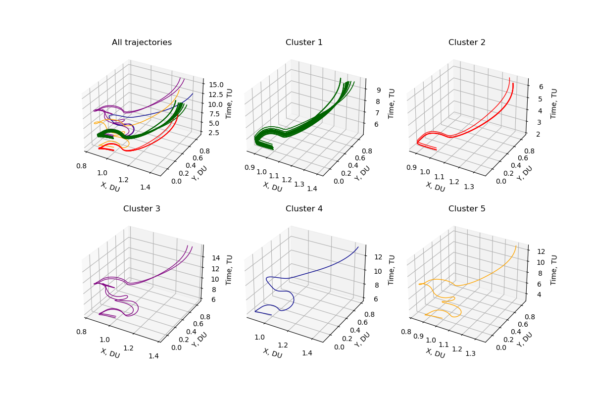
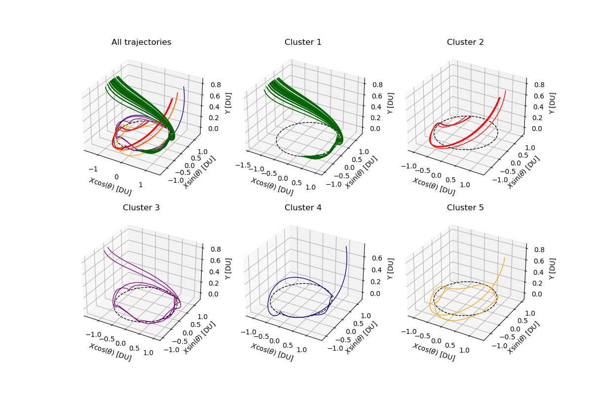
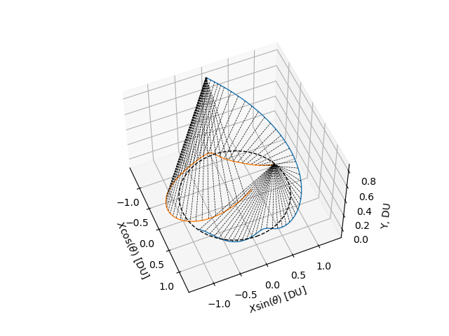

# Periodic Trajectory Clustering
This library, exclusively written in Python, specializes in the clustering and visualization of periodic trajectories. A prime application of this library lies in the context of Cislunar Space Situational Awareness (Cislunar SSA), specifically for clustering low-energy transfers (LETs). Given that the visibility of these trajectories exhibits periodicity influenced by the Sun's rotation, it's essential to incorporate this factor when computing the similarity of trajectories.
<p align="center">
  
</p>
<p align="center">
  
</p>

## Dynamic Time Warping in Periodic State Space
We utilize the Dynamic Time Warping (DTW) algorithm on Low-Energy Transfer (LET) trajectories, which are mapped into a periodic four-dimensional space encompassing position and periodic time. DTW, a classical algorithm used to measure the similarity between two time series, identifies the global alignment between these series without being influenced by a global shift in time. Given that the phase of the periodic time holds as much significance as position in our context, we effortlessly manage both elements together by transitioning them into the periodic four-dimensional space. The example figure below shows the two trajectories half period apart successfully results in the large deviation due to the four-dimensional space representation. 
<p align="center">
  
</p>


# Installation
Clone this repository with
```bash
$ git clone https://github.com/kentotomita/trajectory-clustering.git 
```

# Dependencies
Core dependencies are
- `numba`, `numpy`, `matplotlib`, `scikit-learn`, `pandas`, `tqdm`

The python conda environment can be easily created with
```bash
$ conda env create -f environment.yml
```

<!-- USAGE EXAMPLES -->
# Quick Start 
Locate your data under `data` directory. Then, navigate to `script` directory.
```bash
cd trajectory-clustering/script
```
Running the following scripts in this order generates the distance matrix, clustering, and their visualization. Modify the file path in the scripts accordingly. Computation of the distance matrix takes 5-10 minutes for 55 LETs. Outputs are saved in `out` directory. 
```bash
python compute_dist.py
python clustering.py
python visualization.py
```

To compute and visualize the DTW distance and alignment for specific pairs of two LETs, please use the test script located in `test`. Modify the trajectory indices accordingly. 
```bash
cd trajectory-clustering/test
python run_dtw.py
```


#### Notes
- The standard way for trajectory clustering is to use DBSCAN with Dynamic Time Warping (DTW).
- DTW is a similarity measure for time series data.
    - It is non-metric as it does not satisfy the triangular inequality. 
    - The order of the samples in the trajectory has to satisfy monotonicity, but the sampling time does not have huge effect because DTW adjusts the pairs to be compared between trajectories to minimize the total distance, under the monotonicity constraints. 
- To account for the phase w.r.t. the Sun's rotational period, this information has to be added to the state space.
    - This is because DTW only check the order and doesn't take absolute nor relative time into consideration.
        - DTW is used to compare two sequences that may vary in speed. 
    - Inside the DTW algorithm, we need to adjust the distance function between the two states, as to account for the periodicity of the phase. 
        - We can use Euclidian distance, but only for the phase dimenison we can take $|\theta| \% \pi$. 